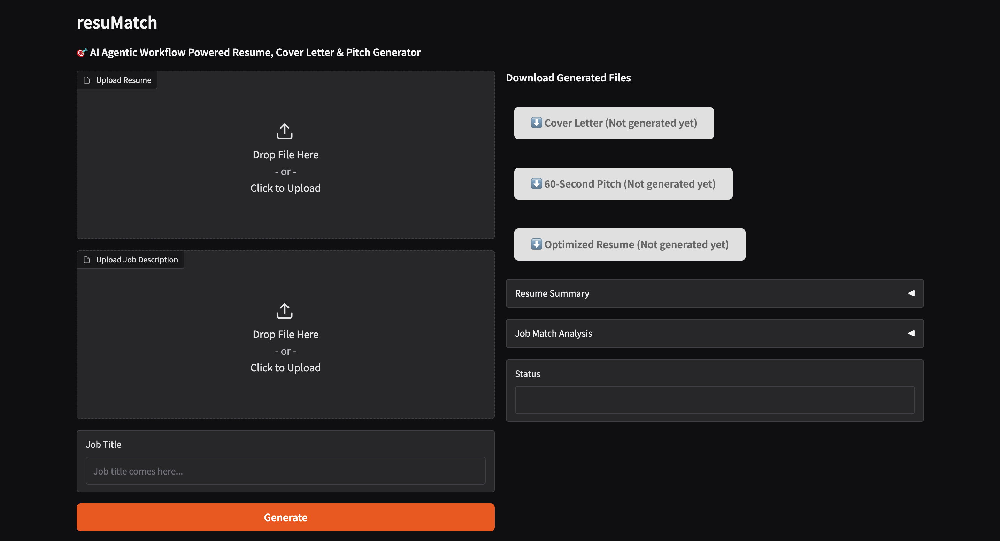
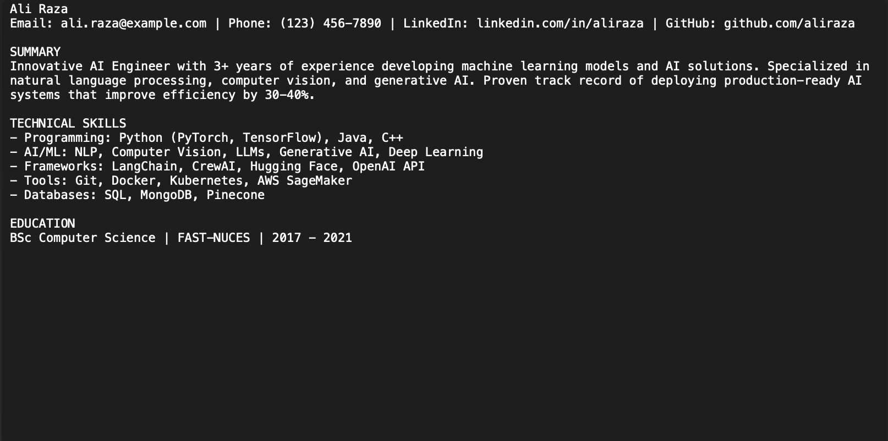
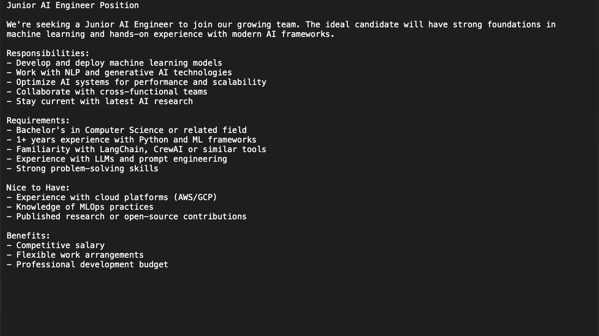
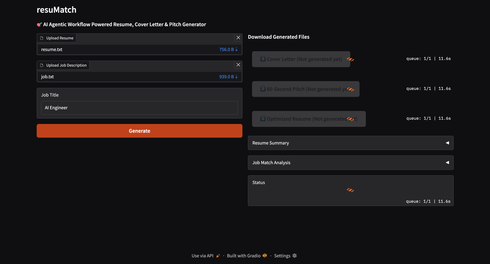
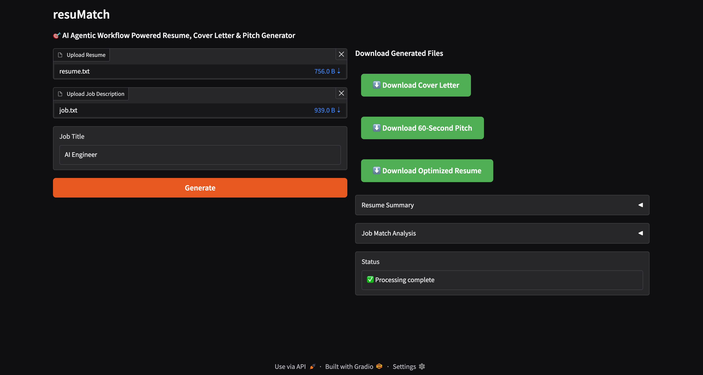

# resuMatch 🚀

AI - powered Resume, Cover Letter & Pitch Generator using agentic workflows with LAngGraph, FastAPI, and Gradio.

## Features ✨

- **AI-Powered Processing**: Generates tailored cover letters, pitches, and resume edits
- **PDF Export**: Direct download of all generated documents
- **Analysis Reports**: Detailed resume summary and job match analysis
- **User-Friendly UI**: Gradio-based web interface
- **API Endpoints**: Fully documented FastAPI backend

## Tech Stack 🛠️

- **Backend**: FastAPI (Python)
- **Frontend**: Gradio
- **AI Framework**: LangChain
- **Containerization**: Docker
- **PDF Generation**: WeasyPrint

## User Journey 🛣️

### 1. Landing Page

- Clean interface with file upload options
- Clear call-to-action buttons

### 2. Upload Documents

- **Resume**: Upload as .txt
- **Job Description**: Upload as .txt
- **Job Title**: Enter target role

### 3. AI Processing

- System analyzes resume/job match
   - First Agent will Summarize the uploaded resume
   - Second Agent will find similarities in the job description and the summarized resume
- Generates tailored documents:
  - ✏️ Optimized Resume Edits
  - 📄 Cover Letter
  - 🎤 60-Second Pitch

### 4. Results & Download

- Download generated PDFs:
  - ✏️
  - 📄 
  - 🎤 
- View AI analysis:
  - 📊 Resume summary
  - 🔍 Job match score

### 5. API Integration (Optional)
POST /api/process_resume/
Payload: resume_file, job_desc_file, job_title
